# Hi 👋, I'm Kotha Syamala

### Salesforce Developer • Java & AI Developer

Building practical enterprise applications using <strong>Salesforce</strong>, <strong>Java</strong>, <strong>Spring Boot</strong>, and <strong>Artificial Intelligence</strong>.

---

# 👨‍💻 About Me

I'm an **Information Technology student at Vishnu Institute of Technology** with a strong interest in **Salesforce development, Java backend development, and Artificial Intelligence**.

I enjoy transforming real-world business requirements into practical software solutions using **Salesforce CRM, Apex, Lightning Web Components, Flow Builder, Java, Spring Boot, and AI technologies**.

I'm particularly interested in building applications that combine **enterprise platforms, automation, backend engineering, and intelligent AI capabilities**.

* 🎓 **B.Tech Information Technology** — 2023–2027
* 📊 **CGPA:** 9.16 / 10.0
* ☁️ Salesforce Development
* ☕ Java & Spring Boot
* 🤖 Generative AI & Agentforce
* 🗄️ PostgreSQL, MySQL & MongoDB
* 🔧 Git, GitHub, Salesforce CLI & VS Code
* 📍 India

---

# 🚀 Tech Stack

## ☁️ Salesforce

---

## ☕ Java & Backend

---

## 🤖 AI & Generative AI

---

## 🗄️ Databases

---

## 🛠️ Developer Tools

---

# 💼 Professional Highlights

* ☁️ Developing enterprise applications using the **Salesforce Platform**
* ⚡ Building reusable **Lightning Web Components**
* 🔹 Writing **Apex Classes, Triggers, SOQL and SOSL**
* 🔄 Designing business automation using **Flow Builder**
* 🗃️ Working with Salesforce **Data Modeling, Objects and Relationships**
* 📊 Creating **Reports and Dashboards** for business insights
* ☕ Developing backend applications using **Java & Spring Boot**
* 🔐 Implementing authentication using **JWT and Spring Security**
* 🤖 Integrating **Generative AI using Spring AI, Ollama and Mistral AI**
* 🔧 Using **Git & GitHub** for version control

---

# 🚀 Featured Projects

## 🏋️ Gym Management System

**Salesforce CRM Application**

A Salesforce-based gym management solution designed to manage members, trainers, memberships, payments, and automated business processes.

### Key Features

* Member & Trainer Management
* Membership Lifecycle Management
* Payment Tracking
* Apex Triggers
* Scheduled Apex
* Record-Triggered Flow
* Lightning Web Components
* Validation Rules
* Reports & Dashboards
* Salesforce Security & Data Modeling

### Technology Stack

`Salesforce` `Apex` `SOQL` `LWC` `Flow Builder` `Scheduled Apex` `Reports & Dashboards`

---

## 🤖 QuizForge AI

**AI-Powered Quiz Generation Platform**

An AI-powered learning platform that generates personalized multiple-choice quizzes and helps users track their attempts, scores, and learning progress.

### Key Features

* Dynamic AI-powered MCQ generation
* Spring AI integration
* Ollama + Mistral AI
* JWT Authentication
* Spring Security
* RESTful APIs
* Quiz submission & history
* Learning progress tracking
* Responsive React dashboard

### Technology Stack

`Java` `Spring Boot` `Spring AI` `Ollama` `Mistral AI` `React` `PostgreSQL` `JWT` `Tailwind CSS`

---

## 🧑‍💼 Employee Leave Management System

**Salesforce CRM Application**

A Salesforce CRM application developed to automate employee leave requests, manager approvals, and HR leave tracking.

### Key Features

* Employee & Department Management
* Leave Request Management
* Manager Approval Process
* Validation Rules
* Apex Classes & Triggers
* SOQL Queries
* Flow Automation
* Lightning Web Components
* Salesforce Security
* Reports & Dashboards

### Technology Stack

`Salesforce` `Apex` `SOQL` `LWC` `Flow Builder` `Approval Process`

---

# 🏆 Certifications & Achievements

* 🏅 **Salesforce Trailhead Ranger** — 84,050+ Trailhead Points
* 🤖 **Agentblazer Champion '26** — Salesforce Agentforce Learning
* ☁️ **Salesforce Administrator Trailmix** — CRM, Security, Automation & Data Modeling
* 👨‍💻 **Salesforce Developer Trailmix** — Apex, SOQL & Lightning Web Components
* 🧠 **Artificial Intelligence: Concepts and Techniques** — NPTEL
* 🤝 **Communication and Teamwork** — EdX

---

# 📊 GitHub Analytics

---

# 🐍 Contribution Graph

<picture>

<source media="(prefers-color-scheme: dark)" srcset="https://raw.githubusercontent.com/syamalakotha/syamalakotha/output/github-contribution-grid-snake-dark.svg">

<source media="(prefers-color-scheme: light)" srcset="https://raw.githubusercontent.com/syamalakotha/syamalakotha/output/github-contribution-grid-snake.svg">

</picture>

---

# 🌱 Currently Learning

---

# 🎯 Career Focus

I'm looking to grow as a **Salesforce Developer and Software Engineer**, contributing to real-world applications while continuously strengthening my skills in backend development, cloud technologies, automation, and Artificial Intelligence.

### Areas of Interest

`Salesforce Development` · `Java Backend Development` · `Full Stack Development` · `AI Applications` · `Cloud Technologies`

---

# 📫 Connect With Me

---

### 💡 *"Learning continuously. Building practically. Growing as an engineer."*

⭐ **Thank you for visiting my GitHub profile!**

